# Estructuras de datos - 2. Listas enlazadas: Teoría

Veremos las **listas enlazadas simples**.

## Introducción

* Las listas enlazadas permite representar un grupo de elementos presentados como una secuencia.
* ¿Eso no es lo que llamamos array?
* No, tiene algunas diferencias.

---
>Podemos guardar un grupo de elementos del mismo tipo: Enteros, cadena de caracteres, una estructura de C, una clase de Java, etc.
>Tenemos que embutir nuestro objeto dentro de una estructura llamada **nodo**. Los nodos tienen punteros que les permite apuntar a otro nodo.
---

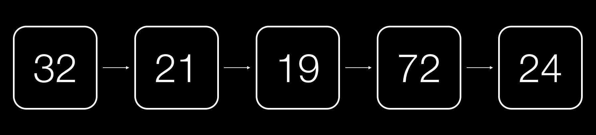

Esto realmente es una lista, un conjunto de nodos apuntados entre sí.

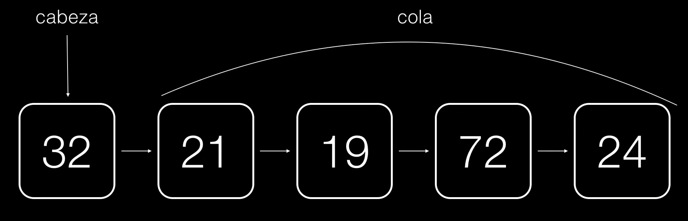

* **cabeza**: Nodo principal, el único que tenemos que conocer para poder trabajar con una lista.

Para acceder al resto de nodos, accediendo a los punteros siguientes de cada uno de los nodos.

Lo que no es cabeza, se denomona normalmente **cola**. También son listas que tiene una cabeza y su cola.

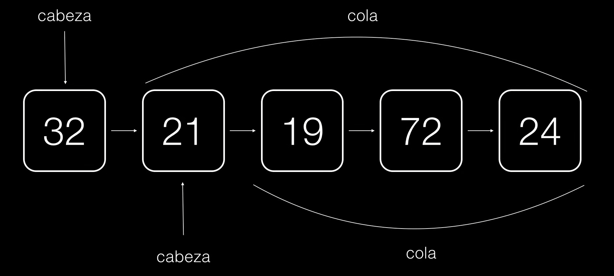

Que a su vez es otra lista y así secesivamente hasta llegar al último elemento. Es un poco especial ya que no apunta a nada.


Apunta a una cosa conocida como **Lista vacía**, es decir una lista que no tiene elementos.

### Ventajas de una lista frente a un array

* Los nodos no tienen por qué guardarse todos juntos en memoria, como ocurre con los arrays.
* Pueden tener longitud variable.
* Podemos agregar y quitar elementos en tiempo de ejecución.

## Desventajas de una lista frente a un array

* Las listas no tienen noción de índice, por lo que no podemos hacer accesos aleatorios.
* Necesitan más espacio en memoria ya que tienes que alamcenar los punteros.

Ejemplo:

```
ESTRUCTURA libro
    nombre : CADENA[50]
    autor : CADENA[50]
    isbn : CADENA[13]
FIN ESTRUCTURA

ESTRUCTURA lista
    cabeza : libro
    cola : PUNTERO A lista
FIN ESTRUCTURA
```

* **cola** como **nulo**: último elemento de la lista.

Esta es la forma que normalmente usamos para guardar listas en lenguajes funcionales, como **Lisp** o **Haskell**. Pero existe una forma mucho más
simple de guardar elementos en una lista que es utilizando dos estructuras.

```
ESTRUCTURA nodo
    elemento : libro
    siguiente : PUNTERO A nodo
FIN ESTRUCTURA

ESTRUCTURA lista
    cabeza : PUNTERO A nodo
FIN ESTRUCTURA
```

* **Estructura nodo**: Se parece a la que hemos visto anteriormente.
* **lista**: Lo único que contiene es una **cabeza**, que es un úntero básicamente al primer nodo.

Lo bueno de la lista, es que puede tener más elementos en su estructua. Por ejemplo, podemos introducirle una longitud o cualquier otro tipo de
metadato que necesitemos.

¿Qué hacemos con listas?

## Crear un nodo

```
FUNCIÓN CrearNodo( l: Libro ): Nodo
    VARIABLE nuevoNodo: Nodo

    nuevoNodo.elemento = l
    nuevoNodo.siguiente = NULO
    DEVOLVER nuevoNodo
FIN FUNCIÓN
```

## Recorrer una lista

* Acceder a cada uno de los elementos de una lista, comenzamos por el primero y terminado por el último.

```
{- Esta es mi lista -}
biblioteca: lista

{- Accedo al primer nodo -}
biblioteca.primero

{- Accedo al primer libro -}
biblioteca.primero.elemento
```

¿Cómo puedo acceder a sucesivos elementos? Esto ya es un poco más complicado:

```
{- Accedo al segundo nodo -}
biblioteca.primero.siguiente

{- O al tercero... -}
biblioteca.primero.siguiente.siguiente
```

Y así secesivamente. El problema es que esto no es muy eficiente.

* ¿Cómo recorremos la lista de una forma más flexible?
* Podemos recorrer los elementos en un bucle del primero al último.
* ¿Cómo sabemos cuándo hemos llegado al último nodo?
* Respuesta: cuando el puntero de un nodo apunte a NULL.

```
FUNCIÓN RecorrerLista( l: Lista )
    VARIABLE puntero: Nodo

    puntero = l.cabeza
    MIENTRAS (puntero != NULO) {
        ProcesarElemento(puntero.elemento)
        puntero = puntero.siguiente
    }

FIN FUNCIÓN
```

### Insertar elementos en una lista

* Depende:
  * ¿La lista está vacía?
  * ¿Quieres agregar por el principio? (**preppend**)
  * ¿Quieres agregar por el final? (**append**)
  * ¿Quieres agregar entre medias?

## Insertar elementos en una lista vacía

Si una lista está vacía, entonces no tiene ningún nodo.
```
lista.primero = NULO
```

En ese caso, tan fácil como crear un nuevo nodo y hacer que el puntero del primer nodo que apunte a él.
```
VARIABLE nuevoNodo: Nodo
nuevoNodo.elemento = l
nuevoNodo.siguiente = NULO
lista.primero = nuevoNodo
```

## Insertar elementos al principio

>Es más complejo, pero nos quedará más claro con este gráfico.

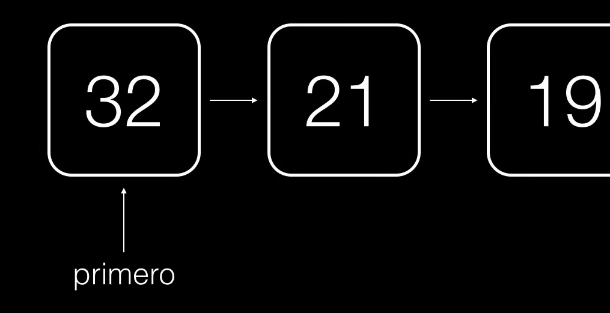

Tenemos una lista que tiene un primer elemento que es 32, y queremos agregar un elemento antes.

Instanciamos un nuevo nodo, hacemos que su **siguiente** apunte al primer **elemento**, y luego actualizamos el **puntero primero** para que
apunte al nuevo **primero**:

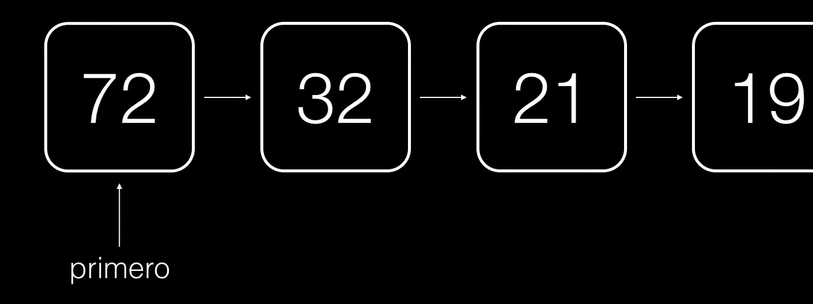

```
PROC InsertarPrincipio(l: Lista, b: Libro)
    VARIABLE nuevoNodo: Nodo

    nuevoNodo.elemento = b
    nuevoNodo.siguiente = l.primero
    l.primero = nuevoNodo
FIN PROC
```

## Insertar elementos al final

>Requiere un poco más de práctica.

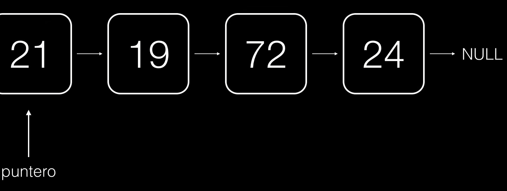

Tenemos que recorrer la lista, hasta llegar a un **elemento** que ya no tenga **siguiente**, es decir, el último elemento:

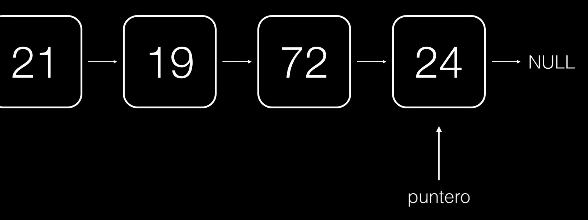

Cuando hayamos llegado a él, instanciamos nuestro nuevo **nodo** y hacemos que el último elemento de la lista ahora apunte al nuevo nodo
recién creado:

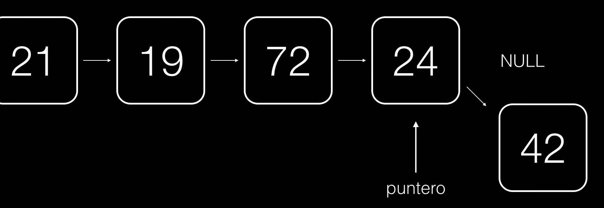

Con esto ya hemos incorporado nuestro nuevo elemento.

## Insertar después de un nodo

* Un nodo que está en cualquier parte de una lista.
* Por ejemplo:
  * Insertar un elemento después de la quinta posición.
  * Insertar un elemento después del libro "El arte de la guerra".

## Insertar elemento en mitad de la lista

(Continuación) Para hacer esto, lo único que tenemos que hacer es recorrer nuestra lista con un puntero llamado **anterior**:

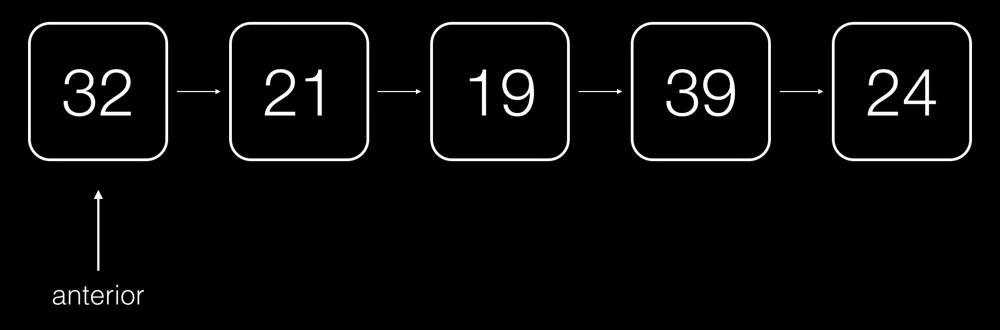

Este puntero va a apuntar al **elemento anterior** al del nuevo elemento que vamos a introducir. Si queremos introducir un elemento después del
19, hacemos que apunte a 19:

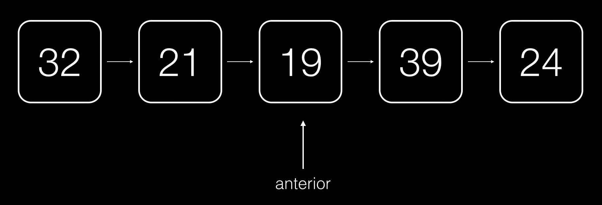

Ahora, instanciamos nuestro nuevo elemento. Lo vamos a meter en un **nodo** que apunte al elemento que sigue a **anterior**:

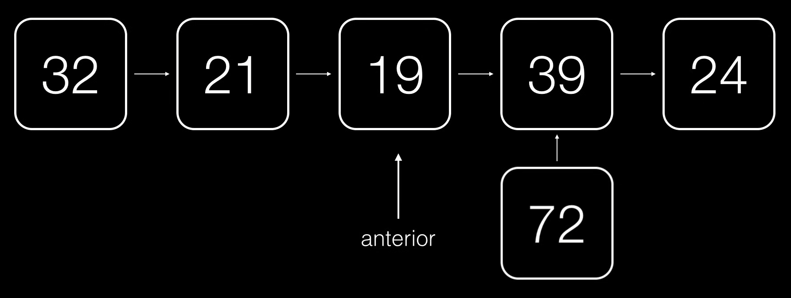

Después, actualizamos el puntero siguiente de **anterior** para que ahora apunte a nuestro nuevo nodo:

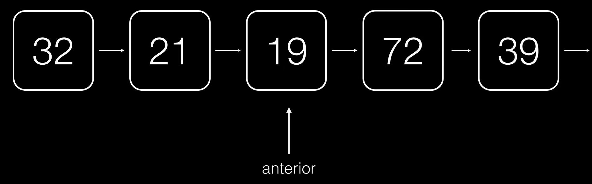

### Eliminar elmentos

* Eliminar elementos requiere jugar con punteros también.
* Cuando vayamos a eliminar un elemento de una lista, tenemos que acordarnos de liberar la memoria ocupada por dicho nodo (en algunos lenguajes de programación).

## Eliminar el primer elemento

* Sea la lista l:
  * ¿l.primero = l.primero.siguiente?
  * ERROR. Si hacemos eso, ¿cómo libero la memoria que ocupa el anterior primer nodo?

>Lo que tenemos que hacer es algo como lo siguiente:

```
PROC EliminarPrimero(l: Lista)
    VARIABLE temporal: Nodo
    
    temporal = l.primero
    l.primero = l.primero.siguiente
    ELIMINAR temporal
FIN PROC
```

## Eliminar el último elemento

* Accedemos a la penúltima posición.
* Eliminamos de forma parecida.

```
PROC EliminarUltimo(l: Lista)
    VARIABLE temp: Nodo
    VARIABLE nodo: Nodo

    nodo = l.primero
    MIENTRAS (nodo.siguiente.siguiente != NULO)
        nodo = nodo.siguiente
    FIN MIENTRAS

    temp = nodo.siguiente
    nodo.siguiente = NULL
    ELIMINAR temp
FIN PROC
```

>Vamos a saber que hemos llegado al **penúltimo elemento** cuando el **siguiente del siguiente** sea **NULO**.
>`nodo.siguiente` sería el último y por lo tanto `nodo.siguiente.siguiente` sería el que viene después del último que debe ser **NULO**.

## Eliminar un elemento medio

* Accedemos a la posición anterior al elemento que quiero eliminar.
* Hago que el puntero de la posición anterior al elemento que quiero eliminar apunte al elemento siguiente, al del elemento que quiero eliminar.

Si quisieramos quitar el elemento 21 de esta lista:

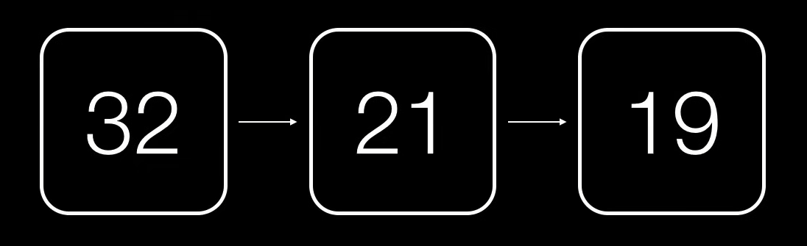

Todo lo que tendríamos que hacer es hacer que 32 apunte como siguiente al que viene después del 21, por ejemplo, a 19:

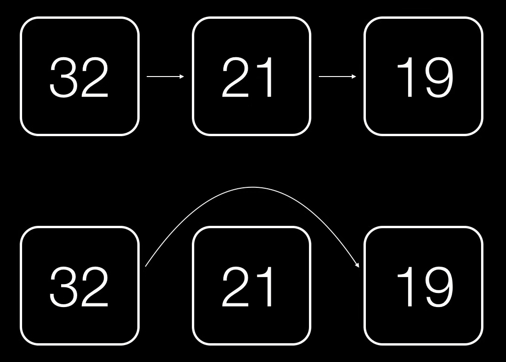

>No olvidemos mantener una referencia a 21 para poder hacer un **delete** cuando vayamos a eliminarlo de memoria.

## En resumen

* Identificar el primer elemento.
* Identificar el último elemento.
* Recorrer una lista.
* Insertar un elemento.
* Eliminar un elemento.